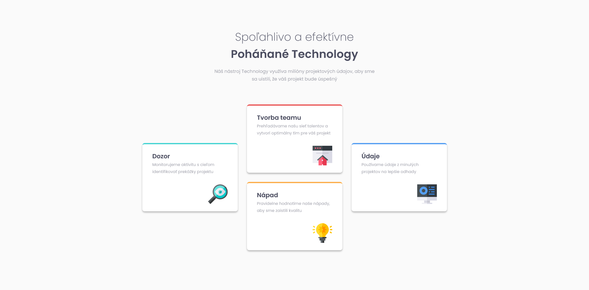
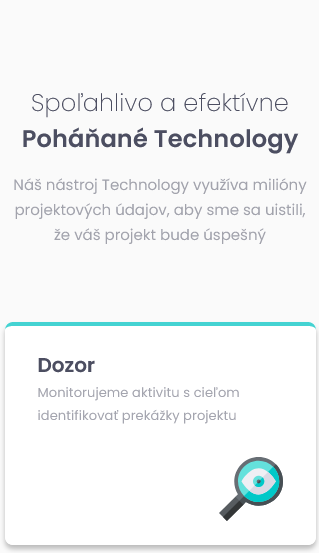

# Frontend Mentor - Four card feature section

## 📝 Informácie o projekte

Tento projekt je zo stránky [Frontend Mentor](https://www.frontendmentor.io/challenges/four-card-feature-section-weK1eFYK). Stránka Frontend Mentor ponúka projekty na vypracovanie, ktoré obsahujú základný text v HTML a grafický dizajn projektu. Pre prácu s dizajnom používam Figmu.

Projekt je jednoduchá stránka na precvičenie responzívneho dizajnu.

## 🏗️ Vytvorenie projektu

Projekt som vytvoril do 4 hodín (čas od stiahnutia projektu až po jeho finálne publikovanie na stránke Frontend Mentor). Použil som HTML,CSS a Sass. Projekt má dizajn pre pre desktop a mobil. Anglické texty z projektu som prepísal na slovenské.

#### [Odkaz na hotovú stránku](https://tomasdunik.github.io/frontend-mentor__four-card-feature-section/)

## 🛠️ Vytvorené s

- HTML
- CSS
- SCSS
- Mobile First

## 📸 Screenshots

### 💻 Desktop

### 📱 Mobil

## 🔗 Projekty Frontend Mentor

- [Tento konkrétny projekt na stránke Frontend Mentor](https://www.frontendmentor.io/solutions/my-version-four-card-feature-section-gO858dXvVv)

- [Moje ostatné projekty na stránke Frontend Mentor](https://www.frontendmentor.io/profile/WeekendsProgrammer)
